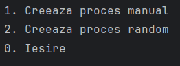
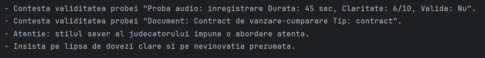
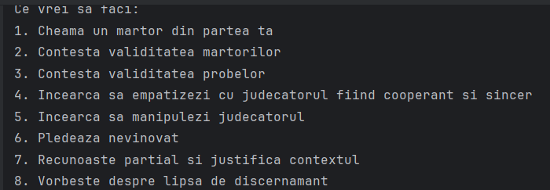
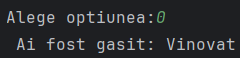

# Simulare Proces Interactiv

Proiectul simulează un proces exact ca in tribunal.
Cand programul pornește user-ul poate alege sa-și creeze propriul lui proces introducând datele manual sau să lanseze unul generat random.

Derularea procesului e una de stil turn-based, fiecare tura începe cu sfatul avocatului(acesta poate avea o strategie random sau una setata, agresiva, echilibrata sau empatica).

Userul poate alege dupa o actiune, urmand sau nu sfatul avocatului, influentand astfel rezultatul procesului.

Dupa ce acesta decide ca s-a aparat destul poate incheia procesul si afla verdictul final.

